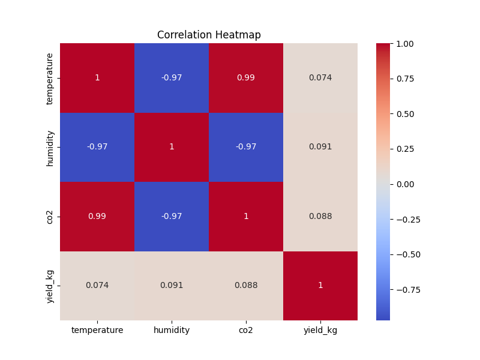
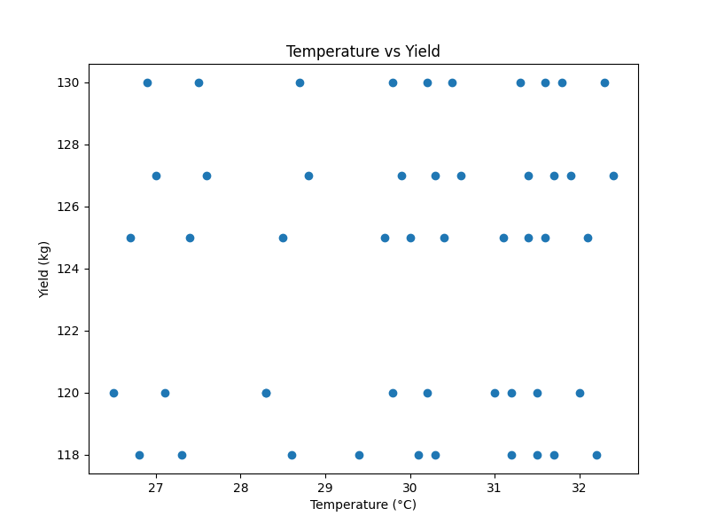
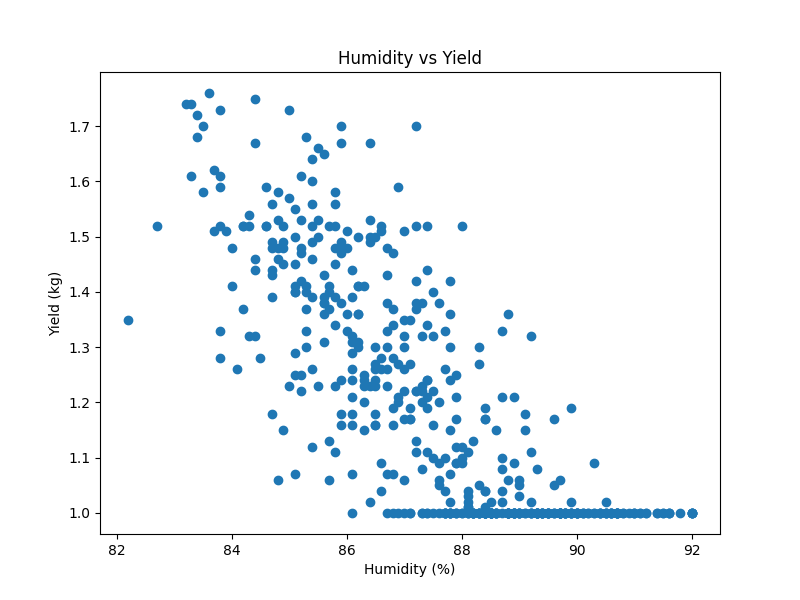
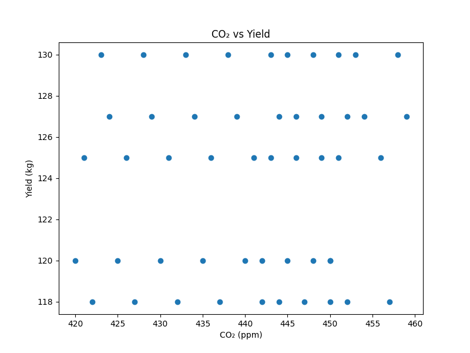
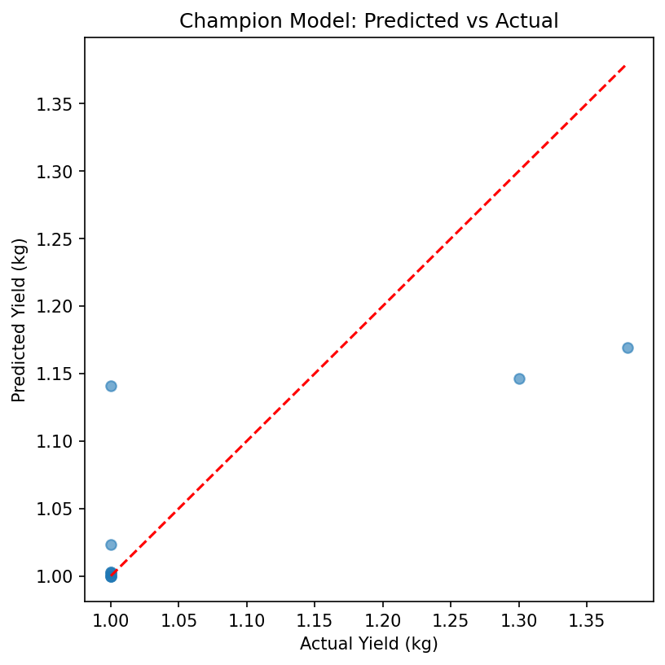
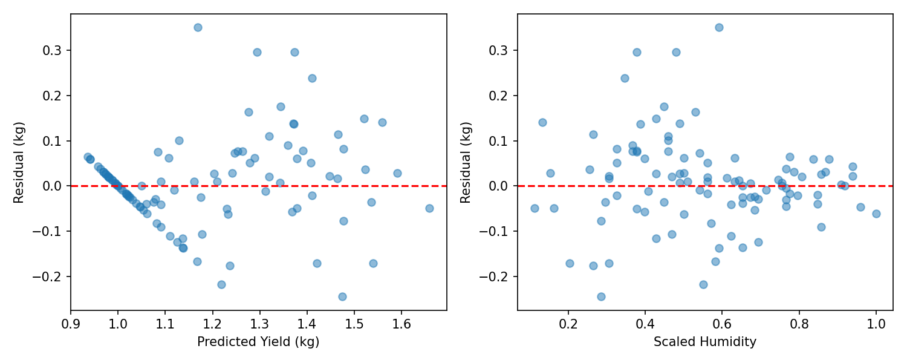
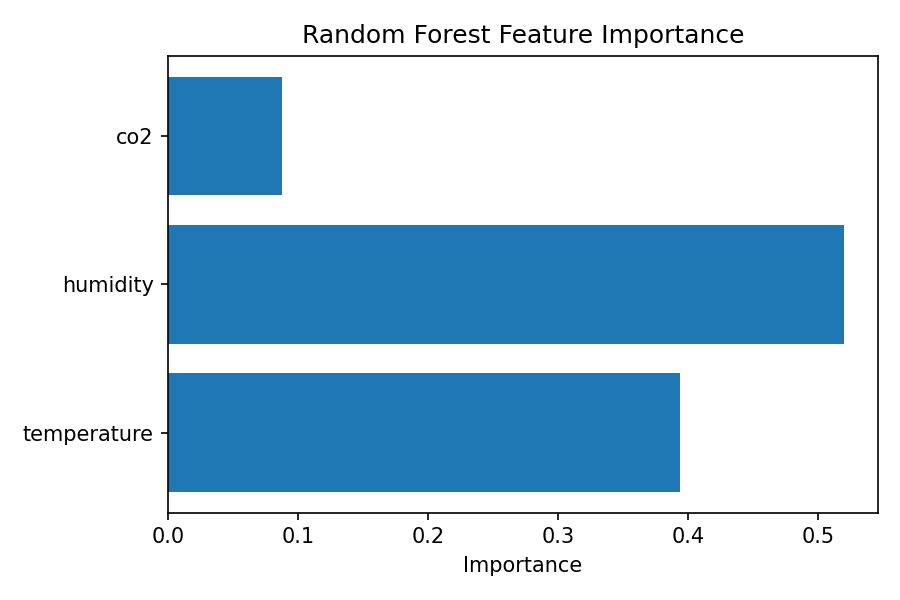
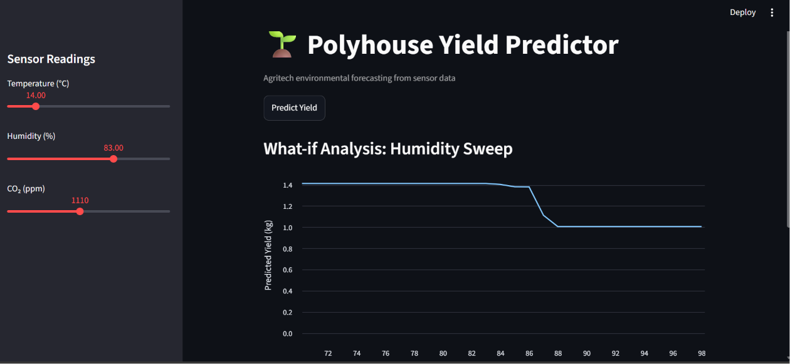

 Polyhouse Crop Yield Prediction System

## Author

Rishika P

## Repository

https://github.com/Rishikap143/polyhouse-sensor-project

## Deployment URL

https://polyhouse-yield-predictor.streamlit.app/

# 1. Problem Statement & Data Description

## Problem Statement

The objective of this project is to predict crop yield (kg) inside a polyhouse environment using environmental sensor data.

The prediction is based on:

* Temperature (°C)
* Humidity (%)
* CO₂ concentration (ppm)

Accurate crop yield prediction helps farmers optimize growing conditions, improve resource allocation, and enhance agricultural productivity.

## Dataset Description

| Column      | Description                  |
| ----------- | ---------------------------- |
| timestamp   | Date and time of observation |
| temperature | Temperature inside polyhouse |
| humidity    | Relative humidity            |
| CO2         | Carbon dioxide concentration |
| yield       | Crop yield (target variable) |

The dataset contains historical sensor readings collected from a controlled polyhouse environment.

---

# 2. Data Cleaning & Exploratory Data Analysis

## Data Cleaning

The following preprocessing steps were performed:

* Checked for missing values
* Removed duplicate records
* Verified data types
* Validated sensor measurements
* Prepared clean dataset for modeling

## Exploratory Data Analysis

The following analyses were conducted:

1. Correlation Heatmap
2. Temperature vs Yield
3. Humidity vs Yield
4. CO₂ vs Yield

### Correlation Heatmap

### Temperature vs Yield

### Humidity vs Yield

### CO₂ vs Yield

### Key Findings

* Temperature showed a strong relationship with yield.
* Humidity exhibited moderate influence on crop production.
* CO₂ concentration contributed positively to yield prediction.
* Features demonstrated useful predictive relationships with the target variable.

---

# 3. Feature Engineering & Temporal Train/Test Split

## Feature Engineering

Selected Features:

* temperature
* humidity
* CO2

Target Variable:

* yield

## Scaling

MinMaxScaler was used to normalize feature values.

The scaler was fitted exclusively on the training dataset to prevent data leakage.

## Temporal Split Rationale

A chronological train-test split was used instead of random splitting.

Benefits:

* Prevents future information leakage
* Simulates real-world deployment
* Preserves temporal relationships in the data

Training data consisted of earlier observations, while testing data contained newer observations.

# 4. Modeling & Evaluation

## Linear Regression Results

MAE: 0.070354

RMSE: 0.099524

R²: 0.801514

## Tuned Random Forest Results

MAE: 0.053530

RMSE: 0.093965

R²: 0.530744

## Hyperparameter Tuning

GridSearchCV was used for hyperparameter optimization.

Best Parameters:

{
    'max_depth': 8,
    'min_samples_leaf': 1,
    'n_estimators': 100
}

### Prediction vs Actual

### Residual Analysis

### Feature Importance

## Model Comparison

| Model               | MAE      | RMSE     | R²       |
| ------------------- | -------- | -------- | -------- |
| Linear Regression   | 0.070354 | 0.099524 | 0.801514 |
| Random Forest Tuned | 0.053530 | 0.093965 | 0.530744 |

### Selected Model

The tuned Random Forest model achieved the lowest prediction error (MAE and RMSE) and was selected as the final deployment model.

---

# 5. Deployment

The final model was deployed using Streamlit.

## Features

* Interactive user interface
* Real-time yield prediction
* Input validation
* Error handling
* Prediction logging

### Streamlit Application

Deployment URL:

https://polyhouse-yield-predictor.streamlit.app/

# 6. Monitoring Strategy

## Prediction Logging

The application records prediction requests in a log file.

Logged fields:

* Timestamp
* Temperature
* Humidity
* CO₂
* Predicted Yield

### Sample Log Entry

| Timestamp           | Temperature | Humidity | CO₂ | Prediction |
| ------------------- | ----------- | -------- | --- | ---------- |
| 2026-06-19 13:01:20 | 22.0        | 65.0     | 850 | 1.01       |

## Drift Detection

Monitor:

* Mean Temperature
* Mean Humidity
* Mean CO₂

Investigate data drift when feature distributions change significantly from training data.

## Retraining Triggers

Retraining should be initiated when:

1. Prediction error increases substantially
2. Data drift exceeds acceptable thresholds
3. Large volumes of new sensor data become available
4. Business requirements change

# 7. Limitations

Current limitations include:

* Limited number of input variables
* Small dataset size
* No external weather integration
* Controlled experimental environment
* Limited production monitoring history

# 8. Future Improvements

Potential future enhancements:

1. Real IoT sensor integration
2. Automated model retraining pipeline
3. Real-time monitoring dashboard
4. Cloud-based ML deployment
5. Additional environmental variables
6. Advanced machine learning algorithms
7. Automated drift detection alerts

# 9. Reproduction Appendix

## Clone Repository

git clone https://github.com/Rishikap143/polyhouse-sensor-project

## Install Dependencies

pip install -r requirements.txt

## Run Streamlit Application

streamlit run app.py

## Train Linear Regression Model

python src/train_linear.py

## Train Random Forest Model

python src/train_rf.py

## Train Tuned Random Forest Model

python src/train_rf_tuned.py

# 10. Conclusion

This project successfully developed an end-to-end machine learning pipeline for predicting crop yield in a polyhouse environment. The workflow included data cleaning, exploratory analysis, feature engineering, model training, hyperparameter tuning, deployment, and monitoring. The final model was deployed using Streamlit and supports real-time crop yield prediction. The project demonstrates how machine learning can assist agricultural decision-making and provides a foundation for future enhancements involving real-time sensor integration and automated model maintenance.

